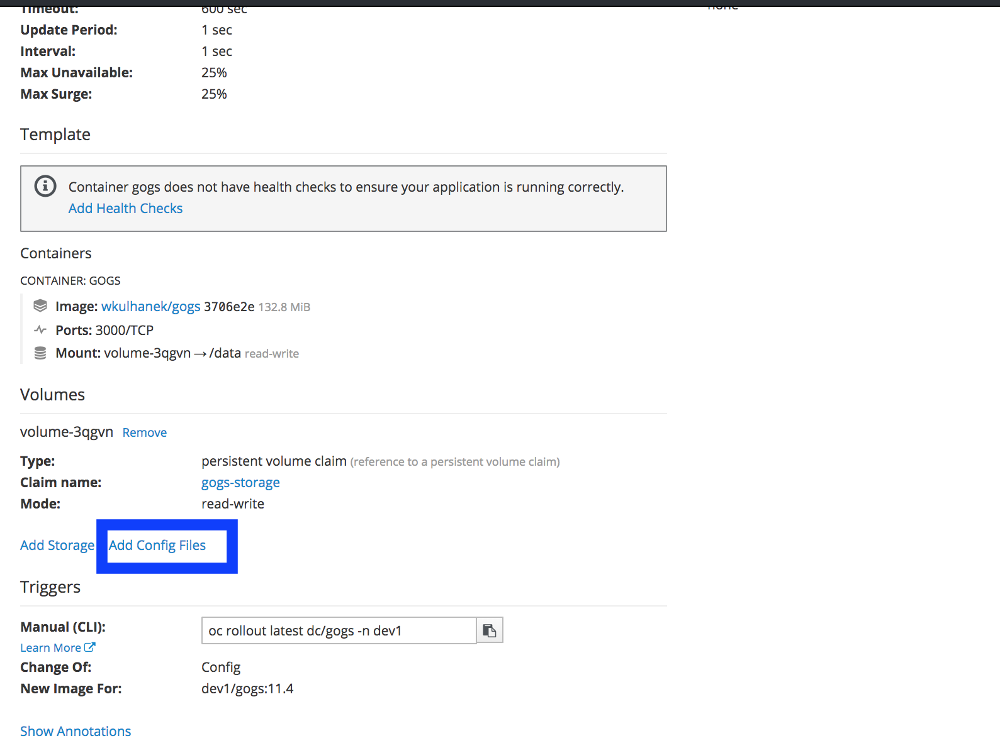
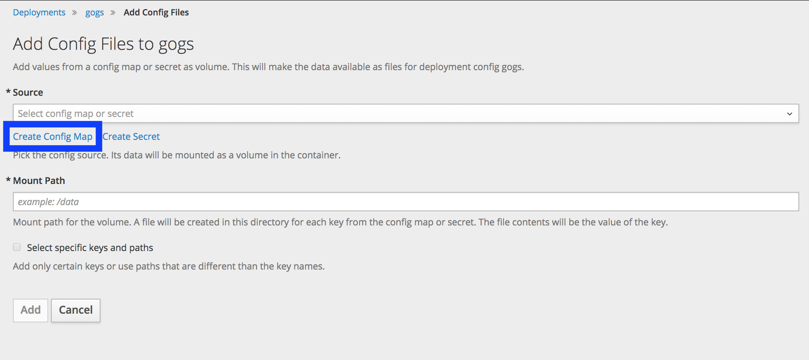
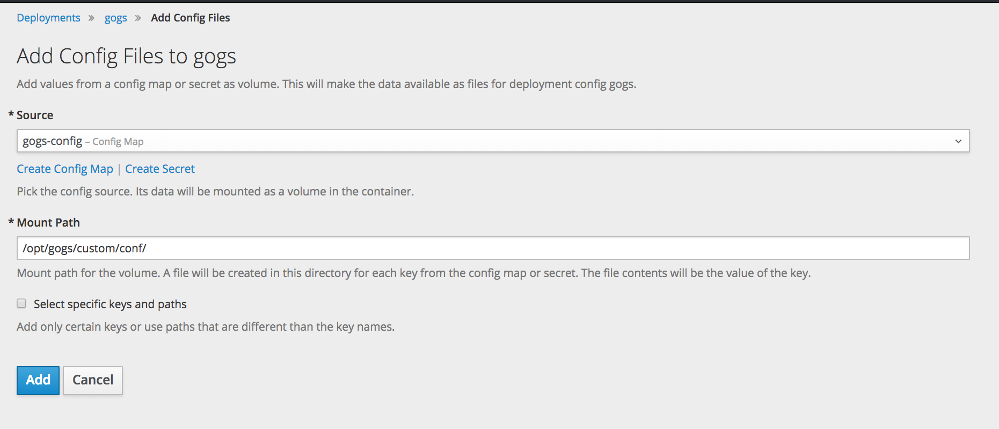

# Using ConfigMaps 

For containers to be portable across environments, we can put configuration paramaters in environment variables. However, most of the applications read their configurations from configuration files. For example, in the Java platform, we call these config files as properties files. 

In this section, we will learn how to externalize configuration files using ConfigMaps.

## Get the contents of /opt/gogs/custom/conf/app.ini
```
[root@openshift todoAPIjs]# oc get pods
NAME                 READY     STATUS    RESTARTS   AGE
gogs-3-t3wqs         1/1       Running   0          9h
postgresql-1-7969q   1/1       Running   0          10h
```
- Take note of the pod and get the contents of /opt/gogs/custom/conf/app.ini.

```
oc rsh gogs-3-t3wqs cat /opt/gogs/custom/conf/app.ini
```
## Create a config map 

Got to Applications->Deployments->Gogs->Configuration. Click on Add Config Files.



Since this is a new config map, we need to create it.



You can use any unique name for the Config Map. In this exercise, we name it gogs-config. The key should be "app.ini".  We then paste the contents of app.ini to the text area. This will be rendered as a file by Kubernetes with filename app.ini.

After saving, you will be taken to the page "Add Config Files to gogs". Click on "Source" and select gogs-config. Set the mount path to /opt/gogs/custom/conf/ and click Add.



This will trigger a redeployment of gogs.

Next Exercise: [Using Jenkins Pipeline](05_using_jenkins_pipeline.md)
